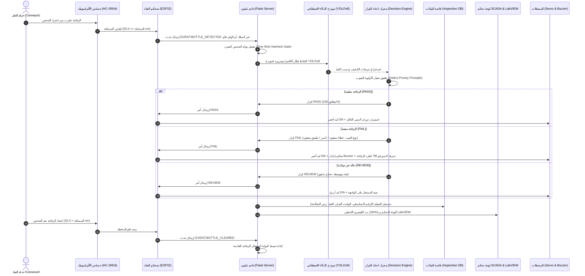

# 📖 دليل المشروع الشامل للمناقشة والفهم الكامل (SmartBottle™ Master Guide)

> **نظام الفحص البصري الصناعي الذكي والفرز الآلي لخطوط إنتاج الزجاجات**
> **Autonomous Industrial Quality Inspection & Defect Rejection SCADA System**

---

## 🌟 1. ما هو هذا المشروع وما هي فكرته الأساسية؟
المشروع عبارة عن **نظام تحكم صناعي مؤتمت بالكامل (Automated Industrial SCADA System)** يهدف إلى مراقبة جودة الزجاجات على خطوط الإنتاج السريعة في المصانع وفرزها آلياً دون أي تدخل بشري.

يجمع المشروع بين أحدث تقنيات:
1. **الذكاء الاصطناعي والرؤية الحاسوبية (AI & Computer Vision)** عبر شبكات **YOLOv8**.
2. **الأنظمة المدمجة والميكاترونكس (Embedded Systems & IoT)** عبر متحكم **ESP32** المبرمج بلغة **MicroPython**.
3. **أنظمة المراقبة والتحكم الإشرافي وتحصيل البيانات (SCADA Dashboard)** عبر خادم **Flask** وتقنية **WebSockets** اللحظية.
4. **التكامل مع برمجيات التحكم الصناعي القياسية (Industrial SCADA)** مثل **National Instruments LabVIEW**.

---

## 🔄 2. رحلة الزجاجة داخل النظام من البداية حتى النهاية (A to Z Workflow)

---

## 📁 3. الفهرس الهندسي لملفات المشروع وما يفعله كل ملف

| اسم الملف / المجلد | الدور والوظيفة الهندسية بالتفصيل |
| :--- | :--- |
| **`requirements.txt`** | يحتوي على أسماء وإصدارات كافة مكاتب البايثون اللازمة للذكاء الاصطناعي، الويب، والسيريال. |
| **`config.py`** | ملف الإعدادات المركزي العام (عتبات الثقة، الكاميرات، منافذ السيريال، وزوايا السيرفو). |
| **`server.py`** | الخادم الرئيسي (Flask + SocketIO): يعالج بث الفيديو، ينفذ استدلال YOLO، ويدير بوابات التزامن ومسارات LabVIEW. |
| **`ai/decision_engine.py`** | محرك اتخاذ القرار: يحول مخرجات YOLO الاحتمالية إلى قرارات صناعية حاسمة (PASS, FAIL, REVIEW) ويمنع التكرار. |
| **`database/inspection_log.py`** | قاعدة البيانات اللحظية المحمية بخيوط التزامن: تسجل العمليات، تحسب الـ KPIs، وتولد ملفات CSV. |
| **`hardware/serial_manager.py`** | مدير الاتصال التسلسلي: يتعرف تلقائياً على بوردة ESP32، ويوفر محاكاة افتراضية ذكية في حال غياب العتاد. |
| **`hardware/esp32_controller.py`** | واجهة تحكم برمجية عليا توحد إرسال الأوامر عبر Wi-Fi REST أو USB السلكي بنقرة واحدة. |
| **`esp32/main.py`** | كود الميكروبايثون الرئيسي المرفوع على ESP32 للتحكم بالحساس، المحرك، السيرفو، الليدات، والإنذار. |
| **`esp32_wifi_controller/main.py`** | كود الميكروبايثون الشبكي لتشغيل ESP32 كخادم ويب REST API مستقل عبر شبكة الواي فاي. |
| **`test_system.py`** | حزمة الفحص والتشخيص الشامل الموحدة: تختبر كافة أجزاء النظام الستة وتؤكد جاهزيته بنسبة 100%. |
| **`train_bottle_defect.py`** | سكربت تدريب نموذج YOLOv8 على منصة Roboflow السحابية وتصدير الأوزان بصيغة ONNX. |
| **`upload_to_esp32.py`** | أداة بايثون لحرق ملف `esp32/main.py` إلى ذاكرة فلاش ESP32 عبر بروتوكول Raw REPL. |
| **`upload_wifi_controller.py`** | أداة بايثون لحرق الكود الشبكي اللاسلكي إلى ESP32 عبر أداة `mpremote`. |
| **`templates/index.html`** | واجهة لوحة تحكم SCADA المتقدمة ثنائية اللغة المزودة براسم إشارة وعدادات تناظرية. |
| **`templates/inspector.html`** | استوديو الفحص والتحليل اليدوي المخصص لرفع الصور أو التقاط لقطات فورية عالية الدقة. |
| **`static/js/app.js`** | المحرك البرمجي للواجهة الأمامية: يدير مقابس WebSockets، راسم الإشارة، التخليق الصوتي، والمخططات. |
| **`static/css/style.css`** | التنسيقات الجمالية الصناعية المتقدمة (Cyberpunk Dark SCADA UI). |
| **`best.pt`** | ملف أوزان الشبكة العصبية YOLOv8 المدربة على اكتشاف الزجاجات وعيوبها. |

---

## 📚 4. دليل المكتبات البرمجية (Libraries & Packages) ولماذا تم اختيارها

### 1. `ultralytics` (YOLOv8)
* **لماذا تم اختيارها؟** أحدث وأسرع مكتبات كشف الأجسام اللحظي في العالم (Real-Time Object Detection).
* **دورها في المشروع:** استلام إطارات الفيديو وتحليلها في زمن لا يتعدى **15-25 مللي ثانية**، وتحديد مواقع المكونات بدقة مع مربعات إحاطة ونسب ثقة مئوية.

### 2. `opencv-python` (OpenCV)
* **لماذا تم اختيارها؟** المعيار العالمي لمعالجة الصور والفيديو الرقمي.
* **دورها في المشروع:** فتح قنوات البث من الكاميرات المختلفة (Webcam, USB Type-C, IP-Cam, ESP32-CAM)، تحويل صيغ الألوان (BGR/RGB)، رسم مربعات الكشف التفاعلية، وضغط الإطارات بصيغة JPEG للبث الشبكي.

### 3. `numpy`
* **لماذا تم اختيارها؟** مكتبة الحوسبة المصفوفية السريعة بلغة C.
* **دورها في المشروع:** تمثيل إطارات الصور كمصفوفات أرقام ثلاثية الأبعاد (Height x Width x Channels) ومعالجتها بسرعات فائقة.

### 4. `Flask`
* **لماذا تم اختيارها؟** إطار عمل بايثون خفيف وسريع ومرن للغاية للأنظمة المدمجة والتطبيقات الصناعية.
* **دورها في المشروع:** تشغيل خادم الويب المحلي، توفير مسارات الـ REST APIs لخدمة المتصفح وبرنامج LabVIEW، وإدارة استدعاءات العتاد.

### 5. `Flask-SocketIO` & `python-socketio`
* **لماذا تم اختيارها؟** توفر اتصالاً ثنائي الاتجاه منخفض التأخير (Full-Duplex WebSockets).
* **دورها في المشروع:** بث بيانات التليمتري الحية (المسافة، العدادات، نسبة الجودة، الـ FPS) بتردد **20Hz** إلى المتصفح دون الحاجة لإعادة تحميل الصفحة.

### 6. `pyserial`
* **لماذا تم اختيارها؟** المكتبة القياسية في بايثون للتحكم بمنافذ الاتصال التسلسلي (RS-232 / UART / COM Ports).
* **دورها في المشروع:** فتح المنفذ التسلسلي مع بوردة ESP32 بسرعة 115200 Baud وتبادل الأوامر والبيانات بسرعة وثبات.

### 7. `roboflow`
* **لماذا تم اختيارها؟** المنصة الصناعية الأولى لإدارة وتجهيز مجموعات بيانات الرؤية الحاسوبية.
* **دورها في المشروع:** استيراد وتنزيل مجموعة صور الزجاجات المصنفة بتنسيق YOLOv8 لتدريب النموذج في سكربت `train_bottle_defect.py`.

---

## 🔌 5. جدول التوصيل الكهربائي للعتاد (Hardware Wiring & Pinout)

| المكون الإلكتروني | رجل ESP32 | الدور الوظيفي | ملاحظات هندسية |
| :--- | :--- | :--- | :--- |
| **الليد الأخضر (Green LED)** | `GPIO 2` | مؤشر الزجاجة السليمة (`PASS`) | موصول عبر مقاومة حماية 220Ω لمنع احتراق الليد |
| **الليد الأحمر (Red LED)** | `GPIO 4` | مؤشر الزجاجة المعيبة (`FAIL`) | موصول عبر مقاومة حماية 220Ω |
| **الليد الأزرق (Blue LED)** | `GPIO 5` | مؤشر المراجعة أو المعالجة (`REVIEW`) | موصول عبر مقاومة حماية 220Ω |
| **صافرة الإنذار (Buzzer)** | `GPIO 18` | إصدار نغمة إنذار عند وجود عيب | القطب الموجب على البن والسالب على الأرضي (GND) |
| **مرسل الألتراسونيك (Trig)** | `GPIO 19` | إرسال نبضة الموجات فوق الصوتية | نبضة رقمية 10 ميكروثانية |
| **مستقبل الألتراسونيك (Echo)** | `GPIO 21` | استقبال صدى النبضة المرتدة | **⚠️ يجب وضع مقسم جهد (1kΩ و 2kΩ)** لخفض جهد 5V إلى 3.3V لحماية المتحكم |
| **محرك السير الناقل (Motor)** | `GPIO 22` | تشغيل/إيقاف السير عبر درايفر L298N | إشارة التحكم بالدوران (IN1) |
| **محرك السيرفو (Servo PWM)** | `GPIO 23` | ذراع طرد الزجاجة المعيبة بزاوية 90° | تردد النبضات 50Hz (بين 0.5ms و 2.5ms) |
| **ريليه الإضاءة (Relay)** | `GPIO 25` | تشغيل إضاءة صندوق الفحص الصناعي | ريليه ميكانيكي لعزل تيار الإضاءة العالي |

---

## 🏭 6. نقاط تكامل LabVIEW (National Instruments SCADA)

يوفر خادم المشروع تكاملاً صناعياً سلساً مع برنامج LabVIEW عبر 3 مسارات رئيسية:
1. **مسار التليمتري الرقمي (`GET /api/labview/telemetry`):**
   يرجع كائن JSON مسطح تماماً (Flat JSON) يحتوي على (إجمالي الفحوصات، السليم، المعيب، نسبة الجودة، قراءة المسافة بالسنتيمتر، وحالة الاتصال). يتطابق مباشرة مع بلوك **`Unflatten From JSON.vi`** في LabVIEW بدون الحاجة لبناء مصفوفات معقدة.
2. **مسار صورة الكاميرا المباشرة (`GET /api/labview/snapshot.jpg`):**
   يرجع أحدث إطار ملتقط كصورة JPEG نقية، يمكن ربطه ببلوك **`Read JPEG File.vi`** أو أداة **`IMAQ Create / Picture Control`**.
3. **التحديث المشترك على القرص الصلب (`C:/SmartBottle/labview_live.jpg` و `.bmp`):**
   يقوم خادم بايثون بتحديث هذا الملف تلقائياً كل 100ms باستخدام الكتابة الذرية (Atomic File Replacement) لتمكين مهندسي LabVIEW من قراءة الصورة المحلية دون مشاكل تعارض أقفال الملفات (File Lock Error 7).

---

## 🎯 7. أسئلة وأجوبة نموذجية لمناقشة المشروع (Exam / Viva Q&A)

### س1: لماذا استخدمنا حساس مسافة (HC-SR04) بجانب الكاميرا؟ ألا تكفي الكاميرا وحدها؟
> **الجواب الهندسـي:**
> إذا اعتمدنا على الكاميرا وحدها، سيقوم النموذج بفحص الزجاجة الواحدة في كل إطار فيديو يمر (30 مرة في الثانية!)، مما يؤدي إلى زيادة العدادات وتكرار ضربات السيرفو بصورة عشوائية.
> وجود حساس الألتراسونيك يوفر **بوابة أمان تزأمنية (Ultrasonic Interlock Gate)**: فالنظام لا يقوم بالفحص إلا عند وصول الزجاجة أمام الحساس على مسافة محددة (<= 25cm)، ويقوم بالفحص **لمرة واحدة فقط (One-Shot)** لكل زجاجة تمر، ولا يفحص مجدداً حتى تفرغ المحطة تماماً.

### س2: ما هو مبدأ "أولوية العيب" (Defect Priority Principle) في محرك اتخاذ القرار؟
> **الجواب الهندسـي:**
> في خطوط الإنتاج الحقيقية، سلامة المنتج والسمعة الصناعية تأتي أولاً. إذا اكتشف الذكاء الاصطناعي وجود "زجاجة" و"ملصق" بنسبة ثقة 90%، لكنه اكتشف أيضاً "غطاء مفقود" بنسبة 60%؛ فإن محرك القرار يتجاهل العناصر السليمة فوراً ويعطي الأولوية القصوى للعيب، فيصدر قرار **`FAIL`** ويطرد الزجاجة فوراً لمنع تعبئة أو خروج منتج معيب للأسواق.

### س3: لماذا تم اختيار MicroPython لبرمجة ESP32 بدلاً من لغة C++ / Arduino؟
> **الجواب الهندسـي:**
> يوفر MicroPython سرعة فائقة في التطوير وإمكانية تعديل الأكواد ورفعها مباشرة عبر المنفذ التسلسلي دون الحاجة لإعادة التجميع (Compilation) في كل مرة، بالإضافة إلى سهولة التعامل مع سلاسل الـ JSON والنصوص، ودعمه لبروتوكول Raw REPL البرمجي الذي مكننا من بناء سكربت رفع آلي بضغطة زر واحدة.

### س4: كيف يعمل النظام إذا لم يكن متحكم ESP32 متصلاً بالحاسوب أثناء العرض؟
> **الجواب الهندسـي:**
> يحتوي موديول `hardware/serial_manager.py` على **نظام محاكاة افتراضي ذكي (Virtual Hardware Fallback)**: بمجرد عدم العثور على منفذ تسلسلي أو انقطاع السلك، يتحول النظام تلقائياً وبشكل شفاف إلى نمط المحاكاة الافتراضية؛ حيث يستجيب لأوامر الـ PASS والـ FAIL، ويحاكي حركة السيرفو وتوقيتات عودته، وتغيير ألوان الليدات وتشغيل السير على الواجهة، مما يضمن عمل النظام بسلاسة في المعارض أو جلسات المناقشة.

### س5: كيف تم حل مشكلة التأخير (Latency) في تدفق الفيديو؟
> **الجواب الهندسـي:**
> 1. ضبط حجم التخزين المؤقت للكاميرا على إطار واحد فقط `CAP_PROP_BUFFERSIZE = 1` لمنع تراكم الإطارات القديمة.
> 2. استخدام نموذج YOLOv8s فائق الخفة والمحسن للاستدلال السريع.
> 3. تشغيل تدفق التليمتري في خيط مستقل (Thread) عن خيط معالجة الفيديو لمنع تعليق الصورة.

---
*تم إعداد هذا التوثيق ليكون مرجعاً هندسياً وتقنياً شاملاً لكل مهندس أو باحث أو طالب يناقش مشروع SmartBottle™ AI Vision SCADA.*
