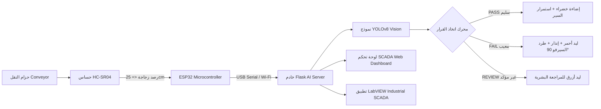

# 🍾 SmartBottle™ AI Vision SCADA
### Autonomous Bottle Quality Inspection & Industrial Defect Rejection System
**نظام الفحص البصري الصناعي الذكي والفرز الآلي لخطوط إنتاج الزجاجات**

---

[](https://www.python.org/)
[](https://ultralytics.com/)
[](https://flask.palletsprojects.com/)
[](https://micropython.org/)
[](https://www.espressif.com/)
[](https://www.ni.com/labview)

---

## 🌟 نظرة عامة (Overview)

**SmartBottle™** هو نظام فحص جودة صناعي مؤتمت بالكامل يدمج بين **الرؤية الحاسوبية (Computer Vision)** والذكاء الاصطناعي **YOLOv8** والأنظمة المدمجة **ESP32** مع لوحة تحكم صناعية تفاعلية **SCADA Dashboard** ودعم مباشر لبرمجيات التحكم الصناعي **National Instruments LabVIEW**.

يقوم النظام بمراقبة الزجاجات المارة على السير الناقل في الوقت الفعلي، واكتشاف العيوب بدقة فائقة، وفرز الزجاجات آلياً عبر ذراع طرد ميكانيكي (Servo Reject Sweep).

### 🎯 فئات الفحص (Inspection Classes):
1. **`bottle`**: جسم الزجاجة.
2. **`cap`**: وجود الغطاء السليم.
3. **`label`**: وجود الملصق السليم.
4. **`cap missing`** ⚠️: عيب غياب الغطاء.
5. **`damaged plastic`** ⚠️: عيب تشوه أو كسر في جسم الزجاجة.
6. **`label missing`** ⚠️: عيب غياب الملصق.

---

## 🏗️ المعمارية الهندسية (System Architecture)



---

## 🔌 جدول التوصيل الكهربائي للعتاد (Hardware Pinout)

| المكون (Component) | رجل المتحكم (ESP32 Pin) | الوظيفة الهندسية (Function) |
| :--- | :--- | :--- |
| **Green LED** | `GPIO 2` | مؤشر المطابقة للمواصفات (`PASS`) عبر مقاومة 220Ω |
| **Red LED** | `GPIO 4` | مؤشر رصد زجاجة معيبة (`FAIL`) عبر مقاومة 220Ω |
| **Blue LED** | `GPIO 5` | مؤشر المراجعة أو معالجة الفحص (`REVIEW`) عبر مقاومة 220Ω |
| **Alarm Buzzer** | `GPIO 18` | التنبيه الصوتي عند وجود عيب في الخط |
| **Ultrasonic Trigger** | `GPIO 19` | إرسال نبضة حساس المسافة (HC-SR04 Trig) |
| **Ultrasonic Echo** | `GPIO 21` | استقبال ارتداد النبضة (عبر Voltage Divider لحماية 3.3V) |
| **Conveyor Motor** | `GPIO 22` | إشارة تشغيل/إيقاف محرك السير الناقل (L298N / Driver) |
| **Reject Servo** | `GPIO 23` | محرك السيرفو لطرد الزجاجات المعيبة (PWM 50Hz) |
| **Inspection Box Relay** | `GPIO 25` | ريليه تشغيل إضاءة صندوق الفحص الصناعي |

---

## 🚀 طريقة التشغيل السريع (Quick Start)

### 1. استنساخ المستودع وتثبيت المكاتب (Clone & Install)
```bash
git clone https://github.com/USERNAME/REPO_NAME.git
cd REPO_NAME
pip install -r requirements.txt
```

### 2. الفحص الذاتي الشامل للنظام (Run Self-Diagnostics)
قبل تشغيل النظام، يمكنك التحقق من جاهزية كافة المكونات (ذكاء اصطناعي، هاردوير، محاكاة، قاعدة بيانات، مسارات الويب، وتكامل LabVIEW) بأمر واحد:
```bash
python test_system.py
```

### 3. تشغيل الخادم ولوحة تحكم SCADA (Launch Production Server)
```bash
python server.py
```
افتح المتصفح على الرابط:
👉 **`http://127.0.0.1:5000`**

---

## 🖥️ مميزات لوحة التحكم (SCADA Dashboard Features)

* **بث فيديو مباشر منخفض التأخير** مع رسم مربعات YOLO ونسب الدقة والتصنيف في الوقت الفعلي.
* **راسم إشارة زمني حي (Ultrasonic Oscilloscope Waveform)** على Canvas لمراقبة حركة الزجاجات ثانية بثانية.
* **مؤشر دائري تناظري (Radial Gauge)** يعرض مسافة الزجاجة بدقة وحالة المحطة.
* **مخطط بياني دائري (Chart.js Donut)** لتوزيع نسب العيوب بين الأغطية والملصقات والبلاستيك.
* **سجل تليمتري حي (Audit Log Table)** مع إمكانية تصفية السجلات وتصدير تقارير **CSV**.
* **نظام تنبيهات صوتية (Audio Synthesizer)** وتحكم يدوي وآلي فوري في جميع المحركات والريليهات.
* **واجهة ثنائية اللغة كاملة (عربي / English)** مع دعم RTL/LTR ونمط ليلي فائق الجمال (Cyberpunk Industrial Dark UI).

---

## 🏭 التكامل مع LabVIEW (National Instruments SCADA)

يوفر النظام مسارات REST API مخصصة ومصممة خصيصاً للربط المباشر مع برنامج **LabVIEW**:
- **تليمتري الحساسات (JSON)**: `GET /api/labview/telemetry`
- **لقطة الكاميرا المباشرة (JPEG)**: `GET /api/labview/snapshot.jpg`
- **التحكم بالمحركات والسيرفو**: `POST /api/hardware/motor?action=on` و `POST /api/hardware/servo?action=reject`

📘 *للاطلاع على المخطط الهندسي وشرح توصيل بلوكات LabVIEW خطوة بخطوة، راجع: [LABVIEW_GUIDE.md](LABVIEW_GUIDE.md).*

---

## 📁 هيكلية ملفات المشروع (Project Structure)

```text
├── config.py              # ملف الإعدادات العامة وعتبات الثقة
├── server.py              # خادم Flask ومعالج الفيديو والـ APIs
├── test_system.py         # الفحص التشخيصي الموحد الشامل
├── best.pt                # أوزان شبكة YOLOv8 المدربة
├── train_bottle_defect.py # سكربت تدريب النموذج على Roboflow
├── upload_to_esp32.py     # أداة حرق كود MicroPython على المتحكم
├── requirements.txt       # قائمة مكاتب البايثون المطلوبة
├── .gitignore             # استثناء الملفات المؤقتة والكاش
├── ai/
│   └── decision_engine.py # محرك اتخاذ القرار (PASS / FAIL / REVIEW)
├── database/
│   └── inspection_log.py  # سجل الفحوصات وحساب الـ KPIs وتصدير CSV
├── hardware/
│   ├── esp32_controller.py # واجهة التحكم البرمجية العليا
│   └── serial_manager.py   # مدير الاتصال التسلسلي ونظام المحاكاة الذكي
├── esp32/
│   └── main.py            # فيرموير MicroPython للـ ESP32
├── templates/
│   ├── index.html         # الواجهة الرئيسية SCADA Dashboard
│   └── inspector.html     # استوديو الفحص والتحليل اليدوي
└── static/
    ├── css/style.css      # التصميم الجمالي المتقدم
    └── js/app.js          # المحرك البرمجي للواجهة
```

---

## 📜 الترخيص (License)
هذا المشروع مرخص تحت رخصة [MIT License](LICENSE).
